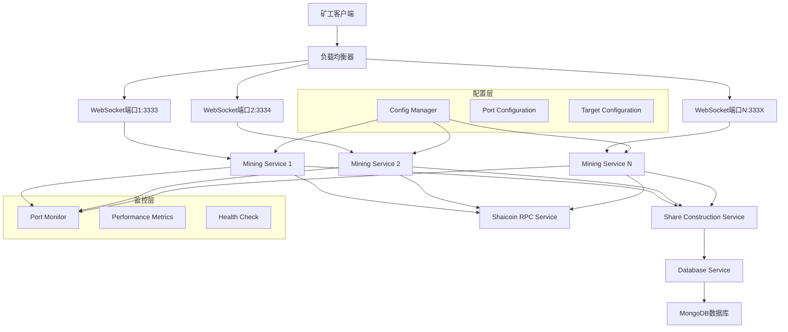
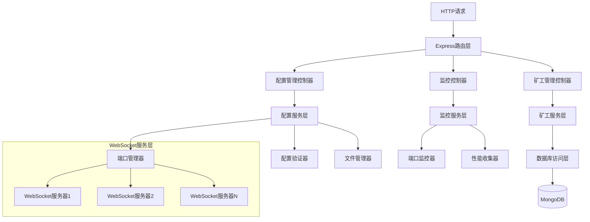
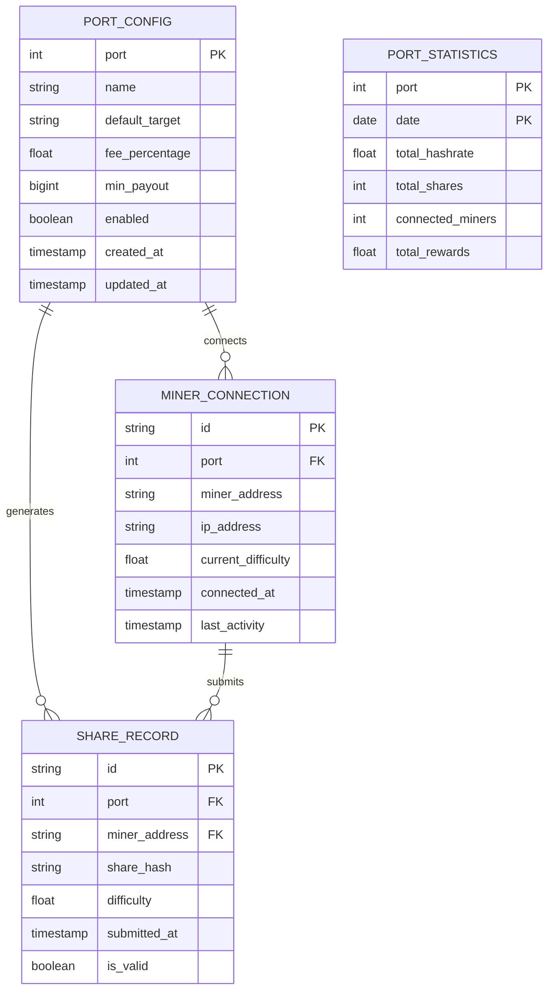

# 多端口矿池系统技术架构文档

## 1. 架构设计



## 2. 技术描述

* Frontend: React\@18 + tailwindcss\@3 + vite + Chart.js

* Backend: Node.js + Express\@4 + WebSocket

* Database: MongoDB (通过现有db\_service)

* Configuration: JSON配置文件 + 动态配置管理

* Monitoring: 自定义监控系统

## 3. 路由定义

| 路由                | 用途                 |
| ----------------- | ------------------ |
| /config           | 配置管理页面，显示和编辑多端口配置  |
| /monitor          | 端口监控页面，实时显示各端口状态   |
| /miners           | 矿工管理页面，按端口分组显示矿工信息 |
| /api/config       | 配置API，获取和更新配置信息    |
| /api/ports        | 端口状态API，获取各端口运行状态  |
| /api/miners/:port | 按端口获取矿工信息          |

## 4. API定义

### 4.1 配置管理API

获取配置信息

```
GET /api/config
```

Response:

| 参数名称            | 参数类型   | 描述     |
| --------------- | ------ | ------ |
| ports           | array  | 端口配置数组 |
| default\_config | object | 默认配置参数 |

Example:

```json
{
  "ports": [
    {
      "port": 3333,
      "name": "Standard Pool",
      "default_target": "000007fffff00000000000000000000000000000000000000000000000000000",
      "fee_percentage": 5,
      "min_payout": 10000000,
      "enabled": true
    }
  ],
  "default_config": {
    "rpc_url": "http://127.0.0.1:8710",
    "pool_mining_address": "sh1ql3n7ukdc852uh70pqmlgt0lutwf5nxgllddhqw"
  }
}
```

更新配置信息

```
POST /api/config
```

Request:

| 参数名称           | 参数类型    | 是否必需  | 描述        |
| -------------- | ------- | ----- | --------- |
| ports          | array   | true  | 端口配置数组    |
| validate\_only | boolean | false | 仅验证配置，不保存 |

### 4.2 端口监控API

获取端口状态

```
GET /api/ports/status
```

Response:

| 参数名称              | 参数类型   | 描述                           |
| ----------------- | ------ | ---------------------------- |
| port              | number | 端口号                          |
| status            | string | 运行状态 (running/stopped/error) |
| connected\_miners | number | 连接的矿工数量                      |
| hashrate          | number | 当前算力                         |
| uptime            | number | 运行时间（秒）                      |

Example:

```json
{
  "ports": [
    {
      "port": 3333,
      "status": "running",
      "connected_miners": 15,
      "hashrate": 1250.75,
      "uptime": 86400
    }
  ]
}
```

## 5. 服务器架构图



## 6. 数据模型

### 6.1 数据模型定义



### 6.2 数据定义语言

端口配置表 (port\_configs)

```sql
-- 创建端口配置集合
db.createCollection("port_configs");

-- 创建索引
db.port_configs.createIndex({ "port": 1 }, { unique: true });
db.port_configs.createIndex({ "enabled": 1 });

-- 初始化数据
db.port_configs.insertMany([
  {
    port: 3333,
    name: "Standard Pool",
    default_target: "000007fffff00000000000000000000000000000000000000000000000000000",
    fee_percentage: 5,
    min_payout: 10000000,
    enabled: true,
    created_at: new Date(),
    updated_at: new Date()
  },
  {
    port: 3334,
    name: "High Difficulty Pool",
    default_target: "000001fffff00000000000000000000000000000000000000000000000000000",
    fee_percentage: 3,
    min_payout: 50000000,
    enabled: true,
    created_at: new Date(),
    updated_at: new Date()
  }
]);
```

矿工连接记录表 (miner\_connections)

```sql
-- 创建矿工连接集合
db.createCollection("miner_connections");

-- 创建索引
db.miner_connections.createIndex({ "port": 1, "miner_address": 1 });
db.miner_connections.createIndex({ "connected_at": -1 });
db.miner_connections.createIndex({ "last_activity": -1 });

-- 创建TTL索引，自动清理30天前的连接记录
db.miner_connections.createIndex({ "last_activity": 1 }, { expireAfterSeconds: 2592000 });
```

端口统计表 (port\_statistics)

```sql
-- 创建端口统计集合
db.createCollection("port_statistics");

-- 创建索引
db.port_statistics.createIndex({ "port": 1, "date": -1 });
db.port_statistics.createIndex({ "date": -1 });

-- 创建复合索引用于查询
db.port_statistics.createIndex({ "port": 1, "date": -1, "total_hashrate": -1 });
```

扩展现有shares集合

```sql
-- 为现有shares集合添加port字段的索引
db.shares.createIndex({ "port": 1, "timestamp": -1 });
db.shares.createIndex({ "port": 1, "minerId": 1, "timestamp": -1 });
```

