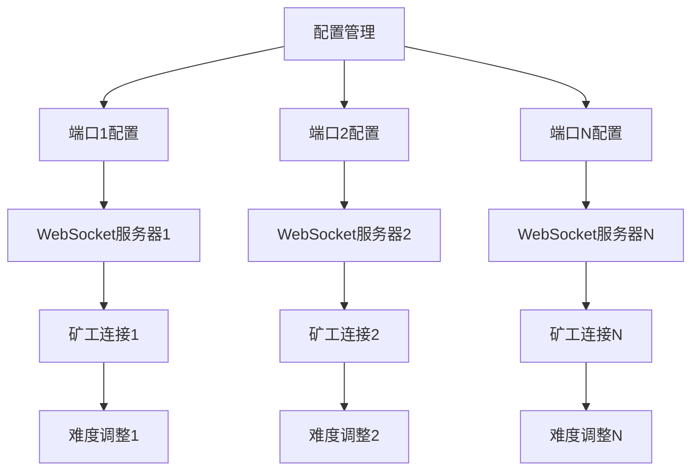

# 多端口矿池系统产品需求文档

## 1. 产品概述

基于现有SHAICoin矿池系统，设计并实现多端口多Target配置功能，允许矿池运营商同时运行多个WebSocket端口，每个端口具有独立的挖矿难度设置和配置参数。该系统将提供更灵活的矿池管理能力，支持不同类型矿工的差异化需求，同时保持向后兼容性。

## 2. 核心功能

### 2.1 用户角色

| 角色 | 使用方式 | 核心权限 |
|------|----------|----------|
| 矿池运营商 | 配置文件管理 | 配置多端口、设置难度、管理费用 |
| 矿工 | 连接指定端口 | 根据端口配置进行挖矿 |

### 2.2 功能模块

我们的多端口矿池系统包含以下主要功能：
1. **配置管理页面**：多端口配置、难度设置、参数管理
2. **端口监控页面**：实时监控各端口状态、连接数、算力分布
3. **矿工管理页面**：按端口查看矿工信息、收益分配

### 2.3 页面详情

| 页面名称 | 模块名称 | 功能描述 |
|----------|----------|----------|
| 配置管理页面 | 端口配置模块 | 添加、编辑、删除WebSocket端口配置。设置端口号、默认target、费用比例、最小支付等参数 |
| 配置管理页面 | 难度管理模块 | 为每个端口设置初始挖矿难度（target值）。支持十六进制输入和验证 |
| 配置管理页面 | 配置验证模块 | 验证配置文件格式、端口冲突检测、参数范围校验 |
| 端口监控页面 | 实时状态模块 | 显示各端口运行状态、连接矿工数、实时算力 |
| 端口监控页面 | 算力分布模块 | 按端口统计算力分布、收益分配情况 |
| 端口监控页面 | 连接管理模块 | 查看各端口连接的矿工列表、IP地址、连接时间 |
| 矿工管理页面 | 端口分组模块 | 按端口分组显示矿工信息、算力贡献 |
| 矿工管理页面 | 收益统计模块 | 按端口统计矿工收益、支付记录 |

## 3. 核心流程

### 矿池运营商配置流程
1. 运营商编辑config.json文件，配置多个端口及其参数
2. 系统验证配置文件格式和参数有效性
3. 启动多个WebSocket服务器，每个端口独立运行
4. 监控各端口运行状态和矿工连接情况

### 矿工连接流程
1. 矿工选择合适的端口进行连接
2. 系统根据端口配置分配初始难度
3. 矿工开始挖矿，系统按端口配置进行难度调整
4. 收益按端口配置的费用比例进行分配

## 4. 用户界面设计

### 4.1 设计风格
- 主色调：深蓝色 (#1a365d) 和科技蓝 (#3182ce)
- 辅助色：绿色 (#38a169) 表示正常状态，红色 (#e53e3e) 表示错误状态
- 按钮样式：圆角设计，悬停效果
- 字体：Inter字体，主要字号16px，标题字号24px
- 布局风格：卡片式布局，响应式设计
- 图标风格：Font Awesome图标库，简洁现代

### 4.2 页面设计概览

| 页面名称 | 模块名称 | UI元素 |
|----------|----------|--------|
| 配置管理页面 | 端口配置模块 | 配置表格、添加按钮、编辑表单、删除确认对话框。使用卡片布局，每个端口一个配置卡片 |
| 配置管理页面 | 难度设置模块 | 十六进制输入框、验证提示、预览显示。实时验证输入格式，显示难度等级 |
| 端口监控页面 | 状态监控模块 | 状态指示灯、实时数据图表、连接数统计。使用绿色表示正常，红色表示异常 |
| 端口监控页面 | 算力图表模块 | 饼图显示各端口算力占比、折线图显示历史趋势。支持时间范围选择 |

### 4.3 响应式设计
桌面优先设计，支持移动端适配。在移动设备上，配置表格转换为卡片列表，图表自动调整尺寸，保持良好的触控体验。